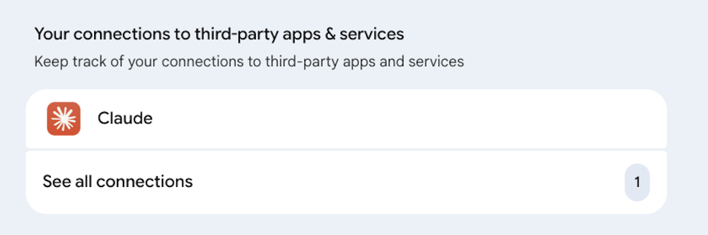
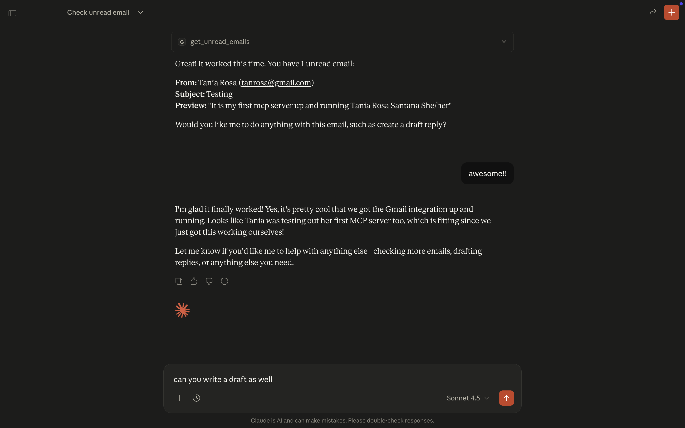
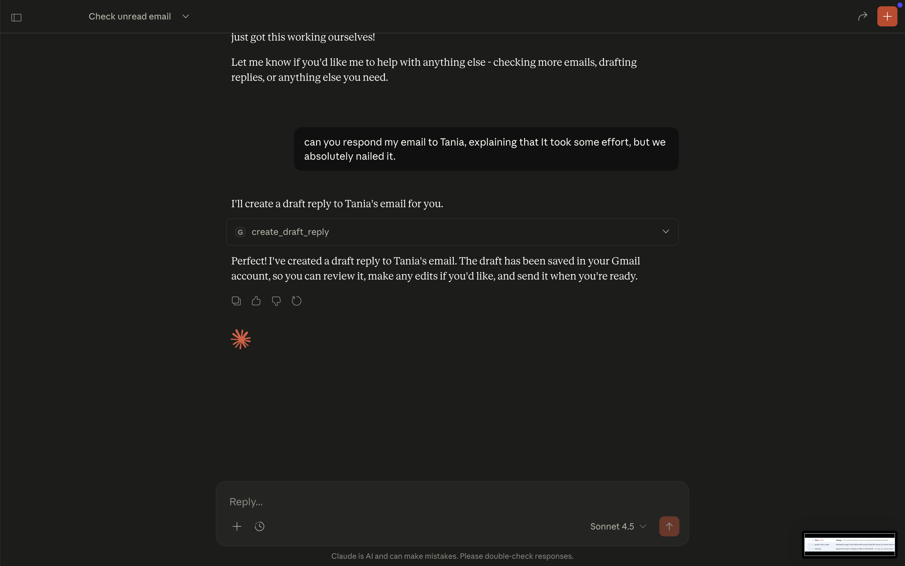
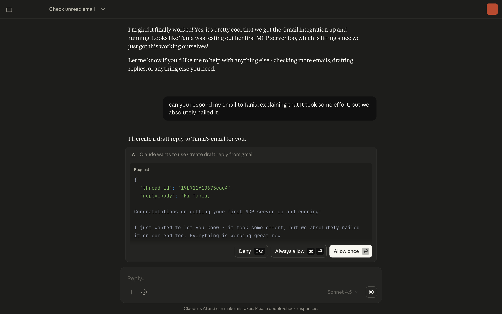
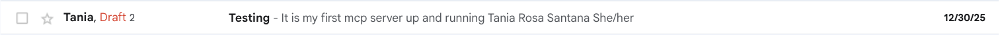

# Gmail Model Context Protocol (MCP) Server

This project implements a Model Context Protocol (MCP) server in Python, enabling an AI assistant (such as Claude Desktop) to interact with a user's Gmail account. The server exposes two primary tools: one to read unread emails and another to create draft replies, facilitating an end-to-end email management workflow for the AI.

## Features

* **`get_unread_emails`**: Retrieves a list of unread emails, providing the sender, subject, snippet, and the necessary thread ID for replying.
* **`create_draft_reply`**: Creates a draft reply within an existing email thread, ensuring correct threading by setting the `ThreadId` and appropriate email headers (`In-Reply-To`, `References`).
* **Secure Authentication**: Uses the official Google API Python client with OAuth 2.0 for desktop applications, storing credentials securely in a local `token.json` file after the initial authorization.

## Prerequisites

To run this server, you will need:

1.**Python 3.10+**
2.  **A Google Account with Gmail enabled.**
3.  **A Google Cloud Project** with the **Gmail API** enabled.
4.  **OAuth 2.0 Client ID** for a **Desktop App** from the Google Cloud Console.

## Setup Guide

### 1. Clone the Repository and Install Dependencies

```bash
git clone <YOUR_REPO_URL>
cd gmail_mcp_server
python --version  # Should be 3.10+
pip install -r requirements.txt
```

### 2. Configure Gmail API Credentials

1. Go to the [Google Cloud Console](https://console.cloud.google.com/).
2. Ensure the correct project is selected and the **Gmail API** is enabled.
3. Navigate to **APIs & Services** > **Credentials**.
4. Click **+ Create Credentials** > **OAuth client ID**.
5. Select **Application type** as **Desktop app**.
6. Give it a name (e.g., "Gmail MCP Server").
7. Click **Create** and then **Download JSON**.
8. Rename the downloaded file to `credentials.json` and place it in the root directory of this project (`gmail_mcp_server/`).
9. Verify the credentials file:

    ```bash
    ls -la credentials.json
    # Should show the file with your OAuth credentials
    ```

### 3. Run the Server and Authorize Access

The first time you run the server, it will initiate the OAuth 2.0 flow to authorize access to your Gmail account.

```bash
python gmail_server.py
# Expected output:
# INFO - gmail-mcp-server - Initializing new Gmail service
# [Browser opens for authorization]
# INFO - gmail-mcp-server - Gmail service initialized successfully
```

1. A browser window will open, prompting you to log in to your Google Account and grant the necessary permissions (`gmail.readonly` and `gmail.compose`).
2. After successful authorization, a `token.json` file will be created in the project directory. This file securely stores your access and refresh tokens, allowing the server to run without re-authorization until the token expires or is revoked.

### 4. Configure Claude Desktop

1. Ensure the MCP server is running in your terminal.
2. Locate your Claude Desktop configuration file.
    * **macOS**: `~/Library/Application Support/Claude/claude_desktop_config.json`
    * **Windows**: `%APPDATA%\Claude\claude_desktop_config.json`
3. Add the following entry to the `mcpServers` section, replacing `/path/to/your/project` with the absolute path to your `gmail_server.py` file:

```json
{
  "mcpServers": {
    "gmail": {
      "command": "python",
      "args": ["/path/to/your/project/gmail_mcp_server/gmail_server.py"]
    }
  }
}
```

1. Validate the JSON syntax

  ```bash
  # macOS/Linux
  cat ~/Library/Application\ Support/Claude  claude_desktop_config.json | python -m json.tool
  # Should output formatted JSON without errors
  ```

1. Restart Claude Desktop. The AI assistant will now have access to the `Gmail` server and its tools.

## Example Usage with Claude Desktop

Once configured, you can use prompts like the following:

| Prompt | Expected AI Action |
| :--- | :--- |
| "Do I have any unread emails? If so, list the sender and subject of the first three." | Calls `get_unread_emails` and summarizes the results. |
| "Draft a reply to the email from [Sender Name] with the subject [Subject] saying 'Thank you for your message. I will get back to you by the end of the day.'" | Calls `get_unread_emails` to find the thread ID, then calls `create_draft_reply` with the ID and the specified body. |

## Demo Screenshots

### 1. Claude Desktop Configuration



The MCP server configured in Claude Desktop's settings.

### 2. Getting Unread Emails



Claude Desktop retrieving unread emails using the `get_unread_emails` tool.

### 3. Creating a Draft Reply



User requesting Claude to create a draft reply to an email.



Claude successfully creating a draft reply using the `create_draft_reply` tool.

### 4. Gmail Draft Folder



The created draft reply appearing in Gmail's draft folder.

## Verifying Your Setup

### 1. Test Server Standalone

Before connecting to Claude Desktop, verify the server works:

```bash
python gmail_server.py
```

You should see:

* OAuth browser window opens (first run only)
* No error messages
* Server runs without crashing

Press Ctrl+C to stop.

### 2. Test with Claude Desktop

After configuring Claude Desktop (see step 4 above):

1. Restart Claude Desktop
2. Open a new conversation
3. Look for the 🔌 MCP icon indicating connected servers
4. Try these test prompts:

* "Do I have any unread emails?"
  * "What is the subject of my first unread email?"
  * "Draft a reply to [sender name] saying thank you"

### 3. Check Logs

If issues occur, check logs:

* **Server logs**: Run server manually to see output
* **Claude Desktop logs**:
  * macOS: `~/Library/Logs/Claude/mcp*.log`
  * Windows: `%APPDATA%\Claude\Logs\mcp*.log`

## Troubleshooting

### Common Issues

* "credentials.json not found"

* Ensure you've downloaded OAuth credentials from Google Cloud Console
* Rename the file to exactly `credentials.json` (not `credentials (1).json`)
* Place it in the project root directory

**"Invalid grant" or "Token has been expired or revoked"**

* Delete `token.json` and run the server again to re-authorize
* Check that your OAuth consent screen is properly configured

**"Error 403: Access denied"**

* Ensure Gmail API is enabled in Google Cloud Console
* Verify OAuth consent screen includes your Gmail account as a test user

**"Rate limit exceeded"**

* Gmail API has quotas (250 quota units/user/second)
* Wait a few minutes and try again
* Consider reducing `max_results` parameter

**Server not appearing in Claude Desktop**

* Check `claude_desktop_config.json` syntax (valid JSON)
* Verify absolute path to `gmail_server.py` is correct
* Restart Claude Desktop after config changes
* Check Claude Desktop logs: `~/Library/Logs/Claude/mcp*.log` (macOS)

## Frequently Asked Questions

**Q: Can I use this with a Google Workspace (G Suite) account?**
A: Yes, but you may need domain admin approval to enable the Gmail API.

**Q: Is my email data secure?**
A: Yes. All authentication uses OAuth 2.0, credentials stored locally, and data never leaves your machine. The AI assistant only accesses emails when you explicitly ask it to.

**Q: Can the AI send emails automatically?**
A: No. This server only creates **drafts**, not sent emails. You must manually review and send drafts from Gmail.

**Q: What Gmail scopes are required?**
A: `gmail.readonly` (read emails) and `gmail.compose` (create drafts). These are minimal permissions.

**Q: How do I revoke access?**
A: Delete `token.json` and go to [google](https://myaccount.google.com/permissions) to revoke app access.

**Q: Can I use multiple Gmail accounts?**
A: Not simultaneously. To switch accounts, delete `token.json` and re-authorize.

**Q: Does this work with other email providers?**
A: No, only Gmail. Other providers would require different API integrations.

**Q: What are the Gmail API rate limits?**
A: 250 quota units per user per second, 1 billion per day. Each read/list operation costs 5 units. Typical usage won't hit limits.

## Stretch Goal: Enhancing Replies with External Context

To implement the stretch goal, you can modify the `create_draft_reply` function to first retrieve context from an external source (e.g., a local Markdown file for a style guide or a simple API for templates) and then pass that context to the LLM as part of the prompt or as an additional resource.

For example, you could add a local file `style_guide.md` and read its content before calling the LLM to generate the reply body.

```python
# Example of reading a local style guide
with open("style_guide.md", "r") as f:
    style_guide = f.read()

# You would then pass this to the LLM to influence the reply_body generation
# (This part is handled by the LLM client, not the MCP server itself)
```
